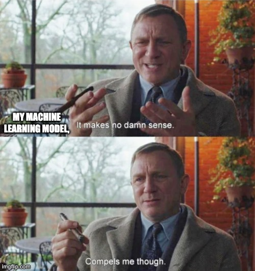

# Model Interpretability: (Gentle) Theory and Astrophysical Applications

  

This repository contains a series of interpretability demos designed for the [2023 IAIFI Summer School](https://iaifi.org/phd-summer-school.html). They are meant to provide a gentle introduction to Shapley values, feature counterfactuals, and saliency maps (with a sliver of uncertainty quantification). Solutions can be found in the [solutions branch](/github/alexandergagliano/InterpretabilityDemos/tree/solutions).
